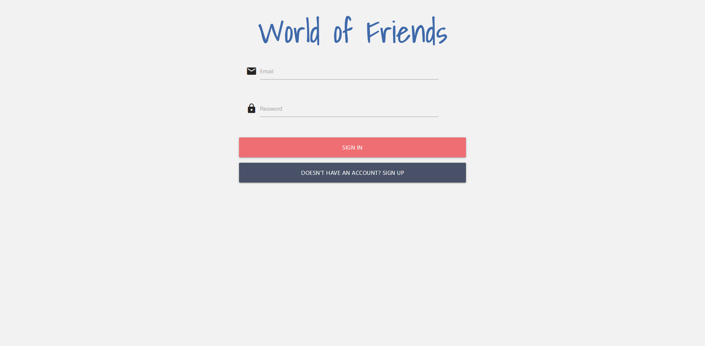
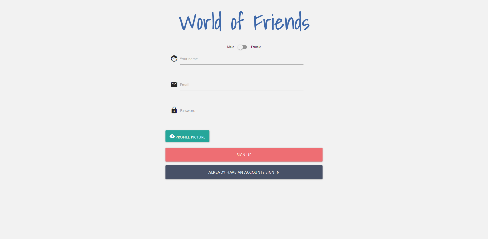
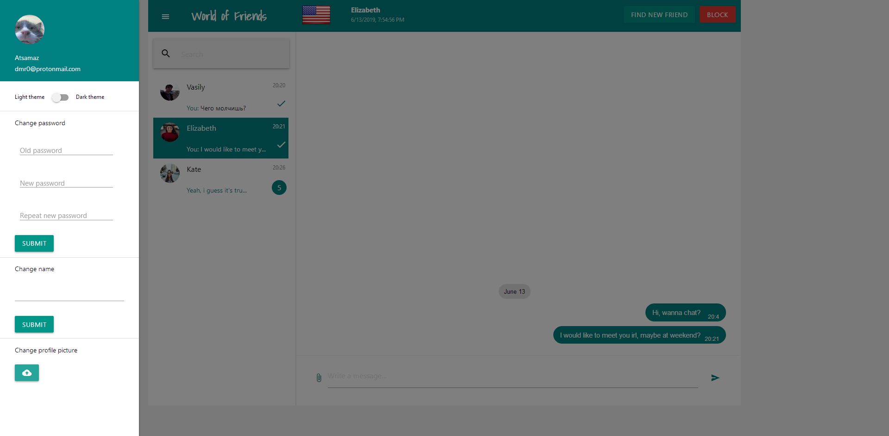
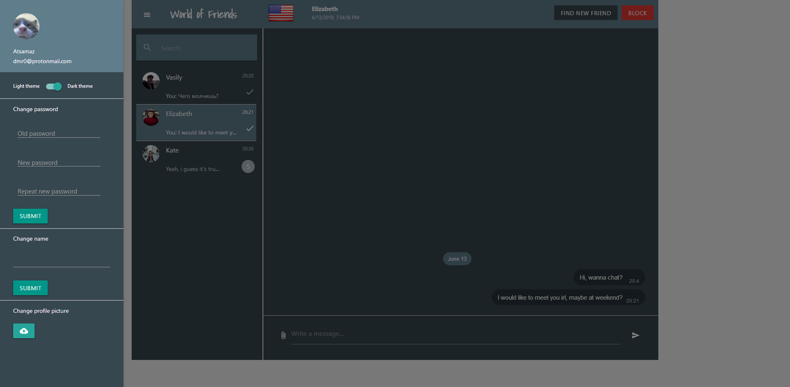
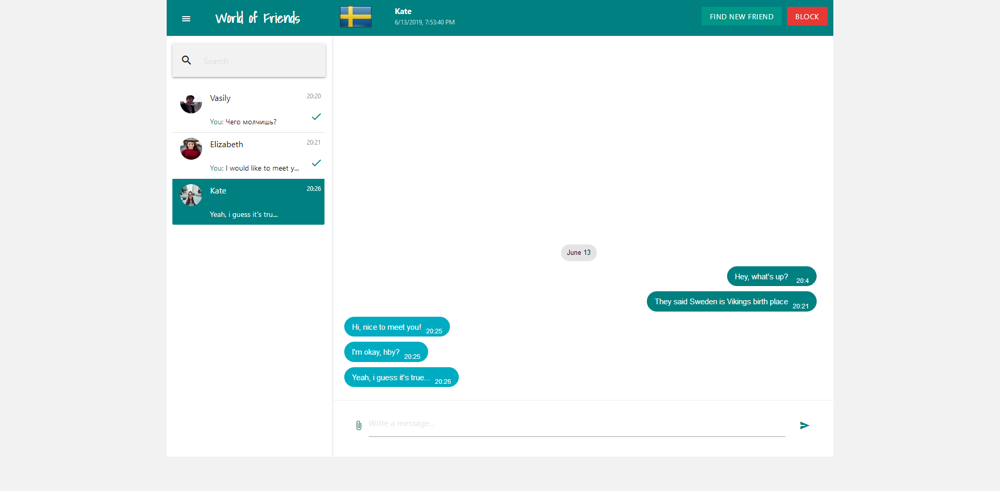
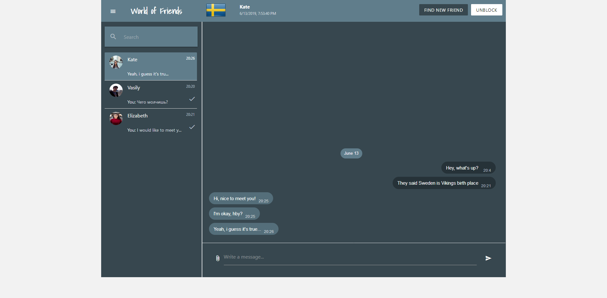

# World of Friends
## Technologies

## Features
- <b>Session authentication</b>
- <b>Random friend finder</b>
- <b>Comfortable chat</b>
- <b>Block/Unblock function</b>
- <b>Theme switcher (Dark / Light)</b>

## Time spent
<i>I was making everything totally from scratch, i've learnt ReactJS, Express.js mostly in developing process and refactored code many times.</i>
- <b>Design:</b> 1 hour 4 minutes
- <b>Frontend:</b> 25 hours 44 minutes
- <b>Backend:</b> 14 hours 22 minutes

## Screenshots
### Authentication page (Sign in & Sign up forms)
 

### Settings
 

### Chat
 

## Author

* **Atsamaz Gatsoev** - [1M50RRY](https://github.com/1M50RRY)

## License

This project is licensed under the MIT License - see the [LICENSE.md](LICENSE.md) file for details
